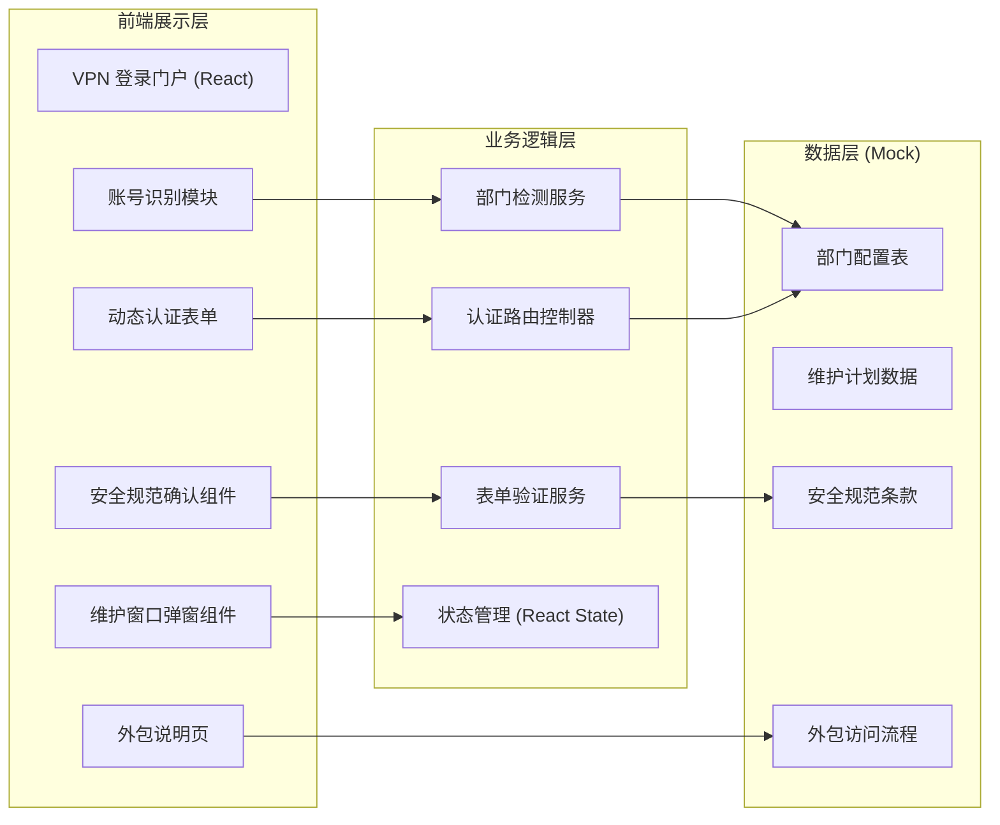

## 1. 架构设计



## 2. 技术说明
- **前端框架**：React@18 + TypeScript
- **构建工具**：Vite@5
- **样式方案**：TailwindCSS@3（严肃克制风格自定义配置）
- **状态管理**：React Hooks (useState, useEffect, useCallback)
- **后端**：无（纯前端演示，内置 Mock 数据）
- **数据持久化**：localStorage（保存维护窗口确认状态）
- **字体方案**：Google Fonts - Noto Sans SC（思源黑体）+ JetBrains Mono

## 3. 路由定义
| 路由 | 页面/组件 | 用途 |
|------|-----------|------|
| `/` | LoginPage | VPN 登录主页面 |
| `/outsourcing` | OutsourcingPage | 外包人员临时访问说明页 |

## 4. 核心数据模型

### 4.1 部门配置 (DepartmentConfig)
```typescript
interface DepartmentConfig {
  prefix: string;
  name: string;
  fullName: string;
  authMethods: AuthMethod[];
  description: string;
  accessScope: string;
}

type AuthMethod = 'password' | 'sms' | 'hardware_token' | 'sso';
```

### 4.2 维护窗口 (MaintenanceWindow)
```typescript
interface MaintenanceWindow {
  id: string;
  title: string;
  startTime: string;
  endTime: string;
  impact: 'high' | 'medium' | 'low';
  description: string;
  affectedServices: string[];
}
```

### 4.3 安全规范 (SecurityPolicy)
```typescript
interface SecurityPolicy {
  id: string;
  title: string;
  content: string[];
  version: string;
  lastUpdated: string;
}
```

### 4.4 登录状态 (LoginState)
```typescript
interface LoginState {
  step: 'maintenance' | 'account' | 'authenticate' | 'success';
  account: string;
  detectedDepartment: DepartmentConfig | null;
  isOutsourcing: boolean;
  agreedPolicy: boolean;
  maintenanceConfirmed: boolean;
}
```

## 5. 部门与认证方式映射表
| 账号前缀 | 部门 | 认证方式组合 | 说明 |
|----------|------|--------------|------|
| `RD-` | 技术研发部 | hardware_token + password | 硬件令牌动态码 6 位 + 静态密码 |
| `FIN-` | 财务部 | sms + password | 短信验证码 6 位 + 静态密码 |
| `HR-` | 行政人事部 | password | 仅静态密码（高强度复杂度要求） |
| `EX-` | 高管层 | sso | 跳转企业 SSO 统一身份认证 |
| `OUT-` | 外包人员 | 无（跳转说明页） | 展示临时访问申请流程 |
