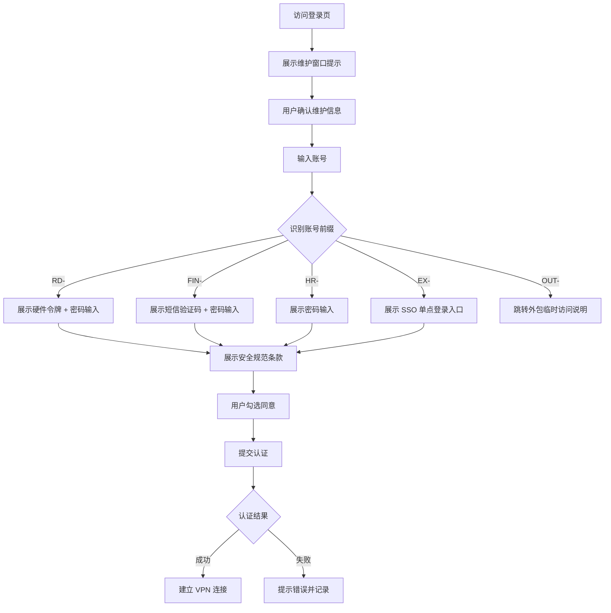

## 1. 产品概述
企业 VPN 安全登录门户，为企业内部员工和外包人员提供分级认证访问入口，强化安全管控与访问审计。
- 面向对象：企业正式员工（按部门划分）、外包/临时人员
- 核心价值：基于角色与部门的多因子认证矩阵，统一安全规范提示，保障企业网络边界安全

## 2. 核心功能

### 2.1 用户角色
| 角色 | 账号标识特征 | 认证方式 | 访问权限 |
|------|--------------|----------|----------|
| 技术研发部员工 | 账号前缀 `RD-` | 硬件令牌 + 密码双因子 | 全业务网络访问 |
| 财务部员工 | 账号前缀 `FIN-` | 短信验证码 + 密码 | 财务系统专用网段 |
| 行政人事部员工 | 账号前缀 `HR-` | 密码 | OA/HR 系统网段 |
| 高管层 | 账号前缀 `EX-` | 单点登录 (SSO) | 全局访问权限 |
| 外包人员 | 账号前缀 `OUT-` | 仅展示临时访问说明 | 受限访问 / 需人工审批 |

### 2.2 功能模块
1. **登录主页**：账号输入、安全提示横幅、维护窗口公告
2. **认证方式动态展示区**：根据部门切换对应认证表单
3. **维护窗口提示层**：登录前强制展示系统维护时间窗口
4. **安全规范确认区**：用户须勾选同意安全规范后方可认证
5. **外包人员专属说明页**：临时访问流程与联系方式

### 2.3 页面详情
| 页面名称 | 模块名称 | 功能描述 |
|----------|----------|----------|
| 登录主页 | 顶部安全横幅 | 展示当前安全等级、最近登录地、锁定状态提示 |
| 登录主页 | 维护窗口公告 | 醒目展示计划内维护时间，临近维护时高亮警告 |
| 登录主页 | 账号输入区 | 输入框带自动识别部门、格式校验 |
| 登录主页 | 认证方式动态区 | 根据账号部门动态渲染：密码、短信、硬件令牌、SSO 入口 |
| 登录主页 | 安全规范确认 | 滚动展示安全规范条款，勾选同意后方可提交 |
| 外包访问说明页 | 临时访问流程 | 申请步骤、审批人联系方式、有效期限说明 |

## 3. 核心流程
用户访问登录页 → 展示维护窗口公告（确认后关闭）→ 输入账号 → 系统识别部门并展示对应认证方式 → 展示安全规范条款 → 用户勾选同意 → 完成认证 → 接入 VPN

## 4. 界面设计

### 4.1 设计风格
- **主色调**：深海军蓝 `#0A1628` 作为背景，钢蓝灰 `#1E3A5F` 作为卡片色
- **强调色**：警戒橙 `#D4691F`（维护警告）、安全绿 `#1B7A4E`（认证成功）、警报红 `#C0392B`（错误）
- **辅助色**：冷灰 `#6B7C93`（次级文字）、冰蓝 `#A8C5DA`（边框线）
- **按钮风格**：直角矩形、细边框、点击下沉微动画、无圆角
- **字体**：中文采用思源黑体（Source Han Sans SC），英文采用 JetBrains Mono（等宽，适合账号/令牌输入）
- **布局风格**：居中卡片式 + 左侧固定信息栏，严格对称网格对齐
- **视觉元素**：无装饰性图标、仅使用功能性线条图标（线性 SVG），整体严肃克制

### 4.2 页面设计概览
| 页面名称 | 模块名称 | UI 要点 |
|----------|----------|---------|
| 登录主页 | 维护窗口弹窗 | 全屏遮罩 + 居中卡片，橙色警戒边框，时间轴式展示维护计划 |
| 登录主页 | 左侧信息栏 | 企业 Logo、系统名称、当前时间、网络状态、安全等级徽章 |
| 登录主页 | 认证卡片 | 宽 480px 固定宽度，细边框，内边距严格对齐 8px 网格 |
| 登录主页 | 账号输入 | 等宽字体，带部门自动检测标签（检测后即时显示部门名称） |
| 登录主页 | 安全规范区 | 固定高度滚动容器，底部带复选框"我已阅读并同意" |
| 外包说明页 | 信息展示 | 时间线式步骤展示，审批联系人卡片，返回登录按钮 |

### 4.3 响应式设计
- 桌面端优先（最低支持 1280px 宽度）
- 平板端（768px~1280px）：左侧信息栏收起为顶部栏
- 移动端（<768px）：卡片全宽展示，安全规范区高度自适应
